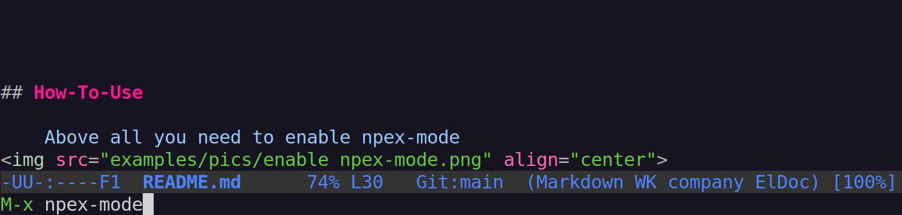
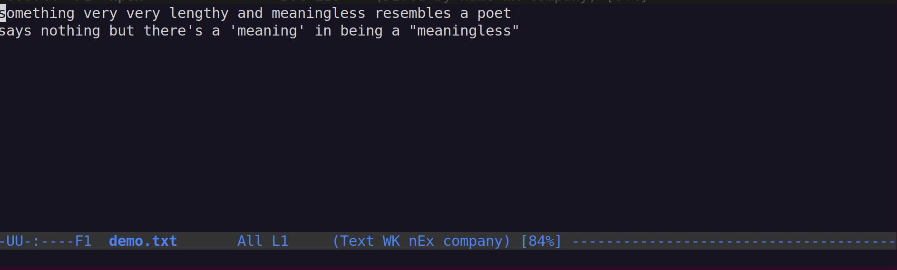
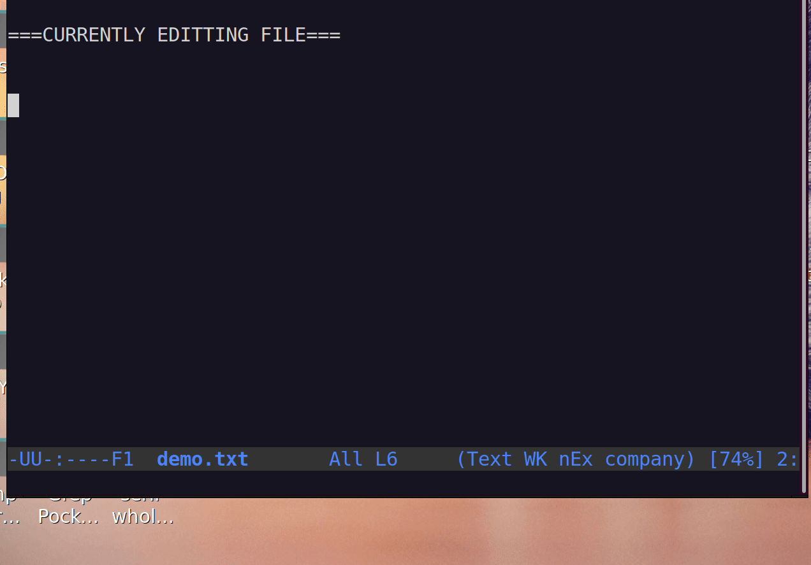

[](https://www.gnu.org/software/emacs/)


----------------------------
# NPEX-MODE  
#### Provides Expanded version of Abbrev-Expansion  
#### LET'S ABBREVIATE EVERYTHING!!
-----------------------------

## Features-Of-Npex-Mode  
#### *npex-mode* is the minor mode of emacs in which you can use  


* Abbrev-expansion not only limited to certain words but also **function** calls  
* Abbrev-expansion into **dynamically** changeable words  
* **Easy** abbrev-table customization (==under development==)  
* One-time escape command after Abbrev-expansion
* **Project specific** Abbrev-expansion (==some of them are implemented==...(・ω・｀))  

------------------------------------------------------------------------------------------


## How-To-Install  

1.Clone **npex** sorce code somewhere you like  

```shell-script
	 mkdir ${dir_somewhere_you_like}
	 cd    ${dir_somewhere_you_like}
	 git clone https://github.com/nyannmaru/npex.git
```

 2.Push the **npex folder** you've cloned into the emacs's `load-path` by appending the emacs-lisp code below into your init.el file  


```emacs-lisp
	(add-to-list 'load-path 
		(file-name-concat "${dir_somewhere_you_like}" "npex"))
	(require 'npex)
```

-------------------------------------------------------------------------------------
#### NOTE


You have to replace ${dir_somewhere_you_like} with the **absolute-path** directory name you've made through the shell-script above  

----------------------------------------------------------------------------------

## How-To-Use  
Open the file you want to edit and enable the *npex-mode*  


Press <kbd>M-x</kbd> `npex-mode` <kbd>Enter</kbd>  


----------------------------------------------------------------------------------

#### NOTE

If the string "nEx" shows up above the minibuffer, it means it is successfuly installed.  
Else if minibuffer complains "npex-mode[No match]", it means  

* you may have mistyped full-name of npex dir at the init-file or  
* you may have appended emacs-lisp code to a wrong file, you should see `user-init-file` of your emacs  


----------------------------------------------------------------------------------


*npex-mode* is aiming at providing a expanded version of `abbrev-expansion` that is a one of powerful features built-in of emacs.

So firstly about how to make a simple expansion of a word into some lengthy words.
#### Demonstration of *npex-easy-add-region*
1.Write a very lengthy string (such as a lengthy function name or a poet that maybe its expresioness is enhanced by refrains)  

2.Press <kbd>C-Space</kbd> and Move cursor to the end point of the phrase  

3.Press <kbd>M-x</kbd> npex-easy-add-region <kbd>Enter</kbd>  

4.Select the type "user"(I'll explain this later)  

5.Feed any string you like(in the demonstration gif I used "lstr") and select 'y'
#### NOTE

This string can not hold <bold>(</bold>, <bold>[</bold>, <bold>{</bold>, 
 <bold>}</bold>,  <bold>]</bold>,  <bold>)</bold>,  <bold>"</bold>  or <bold>'</bold> 

------------------------------------------------------------------------

6.Select 'y'(this occurs because there's no directory in where user abbrev file is saved, once you made this selection will be skipped.)  

7.Write the same string you fed at 5 and press <kbd>Space</kbd>  
  

-------------------------------------------------------------------------------

## Overview of this package  
*npex-mode* is the minor-mode of *emacs*.  
Its functionality is given by overriding the command associated with <kbd>Space</kbd>(I presumed that the command overrode is *self-insert-command*).  
Everytime you press the <kbd>Space</kbd> the word you wrote before the cursor is checked


**IF** (an expansion is associated by `npex-abbrev-definition`)  

* The word would be expnaded


**ELSE**

* Natural self-insertion-command invoked


Associated **Npex-Abbrev-Definitions** are described in the (basically) 5 files which are associated with the current editing buffer(in which npex-mode is on).  
These files are automatically assigned and loaded(if there exists) when the mode is enabled.  


-------------------------------------------------------------
### About FILES  
<dl>
	<dt><bold>npex-using-ufile</bold></dt>
	<dd>Assigned based on the value of <bold>user-full-name</bold></dd>
	<dt><bold>npex-using-mfile</bold></dt>
	<dd>Assigned based on the value of <bold>major-mode</bold></dd>
	<dt><bold>npex-using-bfile</bold></dt>
	<dd>Assigned based on the value of <bold>buffer-file-name</bold></dd>
	<dt><bold>npex-using-pfile</bold></dt>
    <dd>(currently under development...)</dd>
	<dt><bold>npex-using-appendixes</bold></dt>
	<dd>(currently under development...)</dd>
</dl>


### About ABBREV-DEFINITION  
Each abbrev-definition is a **backquoted** or **quoted** list that determines what to do when abbrev-word is expanded.  
For eample

```emacs-lisp
 `("abb" "abbrev" (insert "[Before ") (insert " After]"))
```
* *First term* is a string the word you want to register as *abbreved word*
* *Second term* is a string which would be inserted as *expanded word*
* *Third term* is a expression(not lambda expr) *evaluated before the insertion* of 2nd string
* *Fourth term* is a expression *evaluated after the insertion* of 2nd string

So the above example would be expanded in order  
**"abb"** => **""** => **"[Before "** => **"[Before abbrev"**  
=> **"[Before abbrev After]"**

-------------------------------------------------------------------------

## How-To-Use-Again

1. Open the file you want to edit
2. Call for edit abbrevs <kbd>M-x</kbd> npex-edit-abbrevs <kbd>Enter</kbd>
3. Select any type you like(other than "project", it is not implemented...)
4. Keep selecting *Yes* for saving the current *abbrev-edit* buffer
5. Replace the part **`()** of *abbrev-edit* buffer with abbrev-definitions examples belows
6. Press <kbd>C-x C-s</kbd> for *Save-buffer* not load-buffer(COULD LEAD ERROR)
7. Get back to the editing-buffer
8. Try **npex-abbrev-expasion** by writing "abb" and pressing <kbd>Space</kbd>


```emacs-lisp
'("sim" "Most simple pattern of Npex-Expansion!!")
`("abb" "abbrev" (insert "[Before ") (insert " After]"))


	;;some of mines for 'eamcs-lisp-mode
`(";fix" "" nil (save-excursion (move-end-of-line 1) (insert ";FIXME")))
	;;you have to write nil to before-fun if you wanna add after-fun
`("lam" "lamdba ()" (unless (and (eq (char-before) ?\()
	                             (eq (char-after) ?\)))
                             (insert "()") (backward-char))
	                (backward-char))

;;;;;;;;;;;;;;;;;;;;;;;;;;;;;;;;;;;;;;;;;;;;;;;;;;;;;;;;;;;;;;;;;;;;;;
;;Technically spaking, there's no need 1st, 2nd are to be a raw-string

`("ltime" ,(concat "Loading-time:   " (current-time-string)))
;;slight difference preppending comma or not is vital
;;that's why I emphasized a dynamicity on the first sec
`("etime" (concat  "Expanding-time: " (current-time-string)))

```



